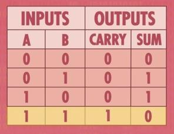
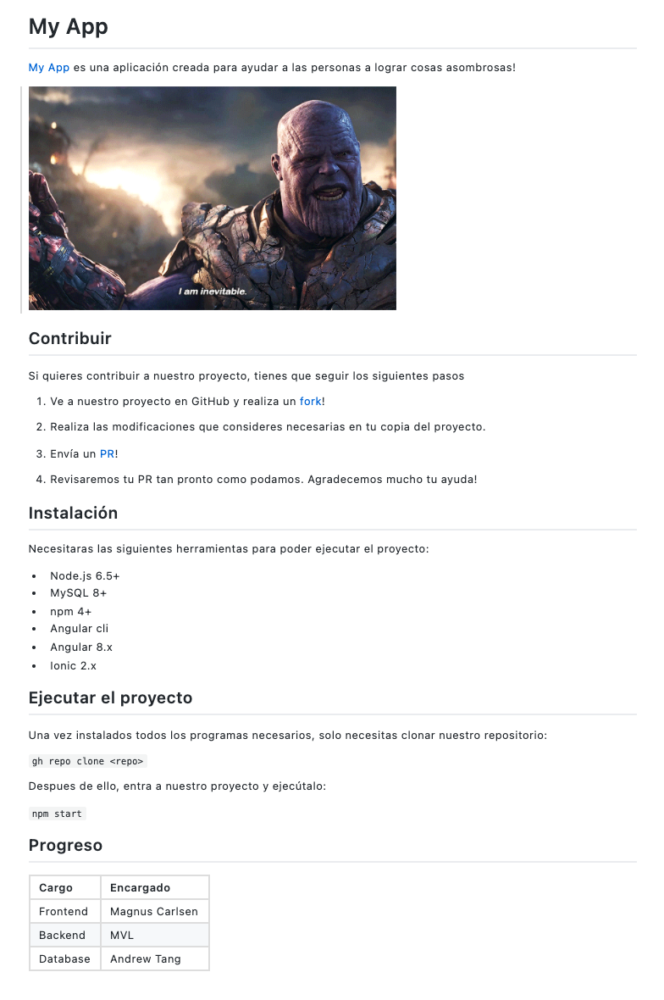

# PC1 (20 puntos)

Duración: 110 minutos

## Compuertas Lógicas

En el laboratorio 2 del curso, aprendimos que la computadora utiliza transistores para almacenar los datos sobre los cuales opera. Debido a ello, el procesador utiliza los operadores lógicos AND, OR y NOT para poder realizar operaciones booleanas o aritméticas.

Un ejemplo de un operador matemático es el operador de suma el cual recibe dos números a operar y devuelve un resultado.

El operador `medio sumador` realiza la operación de suma pero de sólo dos bits. Devolviendo un bit de acarreo y un bit de suma. Su tabla de verdad puede ser apreciada a continuación:



Donde SUM es la Suma de ambos bits, y CARRY es el acarreo de la suma.

Implemente el operador `medio sumador` utilizando [la herramienta online](https://academo.org/demos/logic-gate-simulator/) usada en el laboratorio y únicamente los operadores AND, OR y NOT.

La operación `medio sumador` esta representada por la siguiente ecuación:


*Tip: Empiece analizando la cantidad de entradas y salidas necesarias. Después de ello, empiece a agregar los operadores necesarios. Recuerde que solo puede utilizar los operadores AND, OR y NOT.*

Suba una imagen llamada `pregunta1.png` del circuito creado.

## Operaciones con bits en Python

En el laboratorio 3, aprendimos algunos operadores a nivel de bits de python. Entre ellos, los operadores:
- `&`: realiza bit a bit la operación AND en los operandos.
- `|`: realiza bit a bit la operación OR en los operandos.
- `^`: realiza bit a bit la operación XOR en los operandos.

Se le presenta una función en python llamada `numero_unico`. Dicha función recibe 7 números, todos los números están repetidos una vez. **Sólo uno de ellos no está repetido.**

Se le pide modificar la función número único de tal manera que guarde en la variable `respuesta` el número que no está repetido.

*Restricción: Sólo puede utilizar los operadores mencionados. En otras palabras, solo puede utilizar `&`, `|`, `^`.*

Tiene permitido utilizar `=` para asignar el resultado a la variable `resultado`.

```python
def numero_unico(num1, num2, num3, num4, num5, num6, num7):

  # realice aquí sus operaciones
  # respuesta = ...?
  
  print(respuesta)
```

Ejemplo 1:

Invocar la función con los siguiente valores:

```python
numero_unico(4, 7, 15, 7, 4, 15, 9)
```
Retornará:
```
9
```

Ejemplo 2:

Invocar la función con los siguiente valores:

```python
numero_unico(3, 1, 1, 4, 4, 3, 5)
```
Retornará:
```
5
```

Suba su respuesta en un archivo llamado `pregunta2.py`.

## Git

En el laboratorio 4 aprendimos a utilizar el [Markdown de GitHub](https://docs.github.com/en/github/writing-on-github/getting-started-with-writing-and-formatting-on-github/basic-writing-and-formatting-syntax) para crear nuestro archivo README en nuestra página de GitHub. Se pide que replique el siguiente archivo utilizando en Markdown de Git:



Puede obtener la imagen del siguiente link:

https://preview.redd.it/sk9nb6lgccq31.gif?format=png8&s=4314adede1e763a54cb4b435e3d246da0460d3ae

Puede utilizar cualquier URL donde necesite especificar algún link.

No utilice HTML. Sólo puede utilizar el Mardown de GitHub.

Suba su archivo como `pregunta3.md`

## APIs

En el laboratorio 5, aprendimos a crear APIs utilizando Flask.

Se le pide completar el siguiente código de tal manera que la función devuelva la suma de 2 números recibidos en la URL de la siguiente manera:

```
localhost:8080/suma/4/6
```

Lo cual retornaría

```
10
```

Función a completar:

```python
from flask import Flask, render_template

app = Flask(__name__)

@app.route('/suma', methods=['GET'])
def suma():
    # Su código va aquí
    return

if __name__ == '__main__':
    app.secret_key = ".."
    app.run(port=8080, threaded=True, host=('127.0.0.1'))
```

Al ser una función muy sencilla, no se preocupe por hacerla funcionar en su computadora local. Simplemente siga los pasos para la creación de APIs que se explicó en el curso.

Suba su archivo como `pregunta4.py`

## SQL

En el laboratorio 6 aprendimos a utilizar SQL para la creación de tablas en una [Base de Datos online](https://extendsclass.com/mysql-online.html).

El Gobierno del Perú desea realizar la creación de una base de datos para almacenar la información de las personas que se han vacunado, y los detalles de las dosis que recibieron.

Se le pide para ello, con los siguientes detalles:

1. Crear una tabla llamada `persona_vacunada`.

Debe almacenar la siguiente información

- Nombre completo (Campo obligatorio)
- Género (Campo opcional)
- Email (Campo opcional)
- Nombre de la vacuna (Campo obligatorio)
- Cantidad de dosis (Campo obligatorio)

Usa una columna `id` como llave primaria, esta debe incrementarse con cada inserción.

2. Crear las sentencias `INSERT` para ingresar los siguientes datos a la base de datos

- La persona con nombre `Francisco Vilchez` de género `Masculino` ha recibido 2 dosis de la vacuna Pfizer. No ha especificado email.

- La persona con nombre `Mauree Turner` recibió 2 dosis de la vacuna `Sinopharm`. No especificó género, pero indicó que su correo es `mauree@turner.com`

- La persona con nombre `Rameshbabu Praggnanandhaa` recibió 2 dosis de la vacuna `Covaxin`. No especificó su genero ni su correo.

Suba su archivo como `pregunta5.sql`
